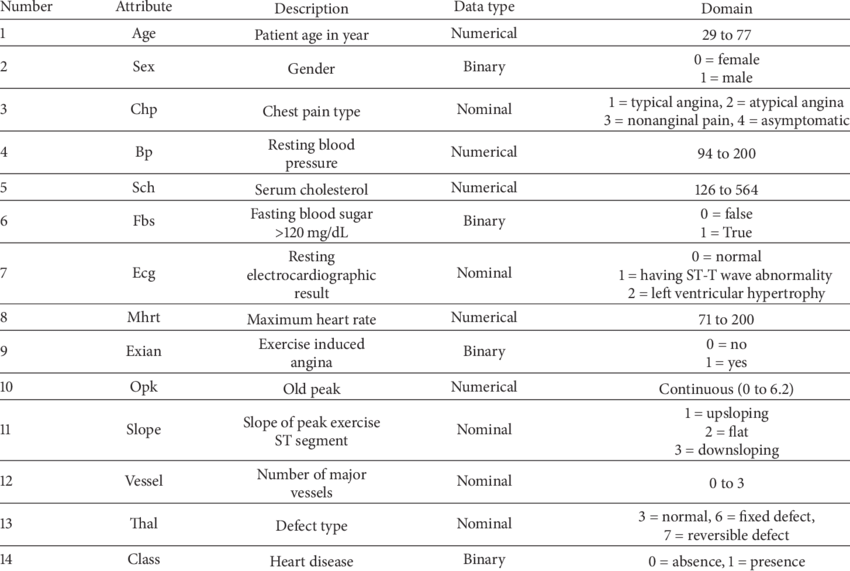

# Cardiovascular Disease Prediction

This repository contains code for predicting cardiovascular disease using machine learning algorithms. It includes data preprocessing, exploratory data analysis (EDA), model selection, hyperparameter tuning, model training, evaluation, and performance reporting.

### Data Description

The dataset used for this project contains information related to various attributes such as age, gender, blood pressure, cholesterol level, chest pain type, etc. A detailed description of the attributes can be found in the image file 

### Data Preprocessing

The data preprocessing steps include handling missing values, renaming columns, dropping irrelevant columns, removing outliers, and ensuring data integrity.

### Exploratory Data Analysis (EDA)

EDA is performed to gain insights into the dataset. Visualizations are created to understand the distribution of various attributes, correlations between features, and relationships between predictors and the target variable (presence or absence of heart disease).

### Model Selection and Hyperparameter Tuning

Three classification algorithms are chosen for predicting cardiovascular disease:
1. Random Forest Classifier
2. XGBoost Classifier
3. Decision Tree Classifier

Hyperparameter tuning is performed using techniques such as Bayesian optimization and grid search to find the best combination of hyperparameters for each model.

### Model Training and Evaluation

The models are trained on the training data and evaluated using performance metrics such as accuracy, precision, recall, and F1 score. Confusion matrices are also generated to visualize the performance of each model.

### Conclusion

Based on the metrics, visualizations, and analysis provided, the `Random Forest Classifier` emerges as the preferred machine learning model for classifying patients cardiovascular disease status. This conclusion is drawn from its higher accuracy of `80%`, compared to `77` and `79%` for both the `Decision Tree Classifier` and the `XGBoost Classifier`. Consequently, the `Random Forest Classifier` outperformed the other models, demonstrating superior predictive capabilities in this scenario. This summary helps in identifying the most effective model for predicting cardiovascular disease based on the provided dataset.

For running the code, make sure to install the required packages listed in `requirements.txt` using the command `pip install -r requirements.txt`.

## Contact-Me:

