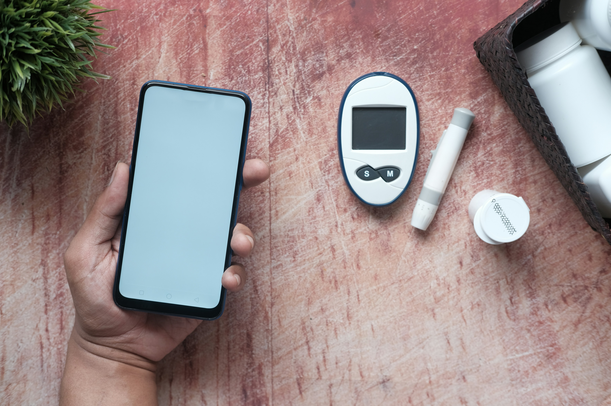

# Patient's Diabetes Prediction

The repository contains python code for analyzing and classifying diabetes in patients. the code utilizes various libraries such as scikit-learn, pandas, seaborn to perform data analysis, visualization and prediction on patients.

## Datasets Overview

The analysis is performed on a dataset named "diabetes.csv", which contains patients medical records from the clinic. The dataset includes information such as Insulin, Age, Glucose, Blood Pressure and Age etc.

## Data Preprocessing

The data preprocessing phase involves cleaning and preparing the dataset for model training. This includes handling missing values,handling outliers, and exploring relationships between features and the target variable.

## Model Development

Two power machine learning algorithms were utilized for the diabetes prediction:
1. Logistic Regression
2. XGBoost Classifier

Hyperparameter tuning techniques such as `GridSearchCV` and `BayesSearchCV` were employed to optimize each model's performance.

## Model Evaluation

The performance of each model was assessed using various evaluation metrics, including confusion matrix visualization, classification reports, and key performance indicators such as R2 Score, Mean Squared Error, and Mean Absolute Error. `Also Features distribution was assessed for the Logistic Regression`.

## Conclusion

After thorough analysis and evaluation, the `XGBoost Classifier` emerged as the top-performing model, achieving an impressive accuracy of `77%`. This model demonstrated superior predictive capabilities compared to the `Logistic Regression`, which achieved accuracies of `74%`. The XGBoost Classifier is therefore recommended for predicting patients diabetes status in this scenario.

for running the code, make sure to install the required packages listed in the requirements.txt using the command `pip install -r requirements.txt`

## Contact-Me:

