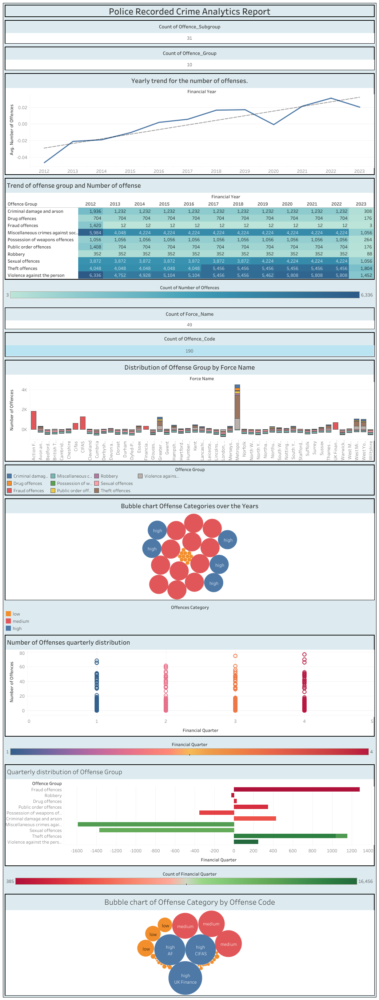

**Crime Prediction Analysis**

**Overview**

This project explores a dataset of police-recorded crime data to analyze crime trends and build predictive models. The goal is to gain insights into crime patterns and develop tools to potentially aid in crime prevention strategies.

**Key Steps**

1. **Data Cleaning and Preprocessing**
   - Reading and examining the dataset
   - Extracting relevant sheets from an Excel file
   - Converting the data to Parquet format for efficient storage
   - Renaming columns for consistency
   - Handling missing values
   - Formatting date columns
   - Analyzing data characteristics and distributions

2. **Exploratory Data Analysis (EDA)**
   - Visualizing crime counts by offence group and subgroup
   - Examining trends over time
   - Exploring relationships between features
   - Identifying potential outliers and anomalies
       
3. **SQL Queries**
   - Creating a SQL database for interactive querying
   - Performing various SQL queries to extract specific information
   - Visualizing query results using Python libraries

4. **Data Preprocessing for Machine Learning**
   - Preparing data for model training
   - Encoding categorical features
   - Splitting data into training and testing sets
   - Standardizing features

5. **Multiple Linear Regression**
   - Building a Multiple Linear Regression model
   - Evaluating model performance using R-squared, MAE, and MSE
   - Analyzing feature coefficients
   - Visualizing actual vs. predicted values

6. **XGBoost**
   - Implementing an XGBoost model
   - Tuning hyperparameters using GridSearchCV
   - Assessing model performance using MAE and MSE
   - Visualizing feature importances

**Results**

- Multiple Linear Regression achieved an R-squared of 0.33, indicating moderate predictive power.
- XGBoost outperformed Linear Regression with lower MAE and MSE.
- Feature importance analysis revealed key factors influencing crime levels.

**Dependencies**

- pandas
- numpy
- matplotlib
- seaborn
- pyarrow
- sklearn
- xgboost
- sqlite3

 
